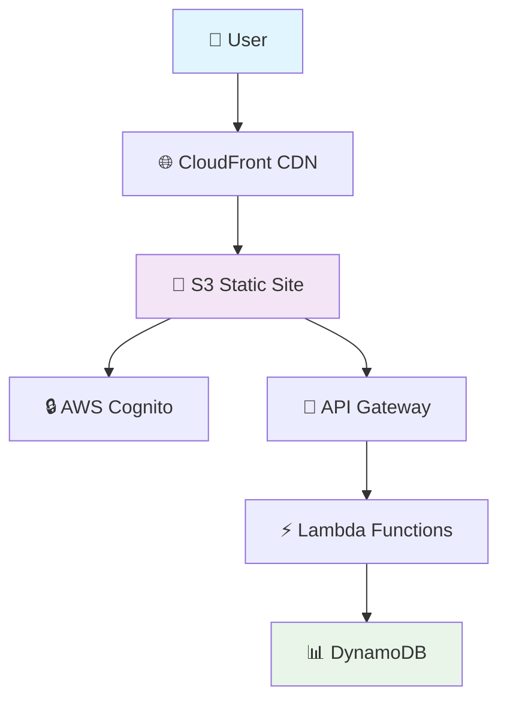

<div align="center">

# 💰 SavEarn
### Smart Money-Saving Tracker with AWS Cloud Integration

*Transform your spending decisions into visible earnings with psychology-driven design*

[](https://your-cloudfront-url.com)
[](https://github.com/rajathverse/SavEarn)
[](https://aws.amazon.com/)


</div>

---

## 🎯 What is SavEarn?

**SavEarn** is a revolutionary web application that reframes money-saving as money-earning through positive psychology. Instead of focusing on what you *didn't spend*, celebrate what you *earned* by making smart financial choices.

### ✨ The Psychology Behind It
- 🧠 **Positive Reinforcement**: Every smart choice becomes an "earning"
- 🎮 **Gamification**: Streaks, progress tracking, and achievement mindset
- 📊 **Visual Progress**: See your smart decisions compound over time
- 💪 **Habit Building**: Transform spending into a conscious, rewarding practice

---

## 🚀 Live Features

| Feature | Description | Status |
|---------|-------------|---------|
| 🔐 **Secure Authentication** | AWS Cognito login/signup | ✅ Live |
| 💰 **Smart Tracking** | Log expensive vs. chosen alternatives | ✅ Live |
| 📊 **Beautiful Analytics** | Interactive charts with Chart.js | ✅ Live |
| ☁️ **Cloud Storage** | DynamoDB data persistence | ✅ Live |
| 📱 **Mobile Responsive** | Perfect on all devices | ✅ Live |
| ⚡ **Instant Loading** | Smart caching system | ✅ Live |

---

## 🏗️ Architecture



---

## 💡 How It Works

### 1. **Log Smart Choices**
```
❌ Expensive Option: Restaurant dinner - ₹800
✅ Smart Choice: Home cooking - ₹150
💰 You Earned: ₹650
```

### 2. **Watch Your Earnings Grow**
- Real-time dashboard updates
- Daily and monthly trends
- Category-wise insights
- Streak tracking

### 3. **Stay Motivated**
- Visual progress charts
- Achievement milestones
- Positive reinforcement UI
- Mobile-friendly interface

---

## 🛠️ Tech Stack

<div align="center">

### Frontend


### Backend & Cloud


</div>

---

## 🚀 Quick Start

### Option 1: Try Locally (30 seconds)
```bash
# Clone the repository
git clone https://github.com/rajathverse/SavEarn.git
cd SavEarn

# Open in browser
start index.html  # Windows
open index.html   # macOS
```

### Option 2: Full AWS Deployment
```bash
# 1. Setup AWS
./setup-aws.bat

# 2. Deploy backend
cd backend
npm install
npm run deploy

# 3. Update config and deploy frontend
# Edit aws-config.js with your API endpoints
# Upload to S3 via AWS Console or CLI
```

---

## 📊 Screenshots

<div align="center">

### 🖥️ Desktop Dashboard


### 📱 Mobile Interface


### 📈 Analytics Charts


</div>

---

## 💰 Real-World Examples

| Scenario | Expensive Option | Smart Choice | Earnings |
|----------|------------------|--------------|----------|
| 🍕 Lunch | Restaurant pizza (₹450) | Home sandwich (₹80) | **₹370** |
| 🚗 Transport | Uber ride (₹300) | Metro (₹25) | **₹275** |
| 👕 Shopping | Brand shirt (₹2000) | Similar quality (₹800) | **₹1200** |
| ☕ Coffee | Café latte (₹250) | Home coffee (₹15) | **₹235** |

**Daily Potential Earnings: ₹2080+**

---

## 🏆 Key Benefits

- **🎯 Psychological Edge**: Positive reinforcement over restriction
- **📈 Data-Driven**: Visual insights into spending patterns  
- **🔒 Secure**: Enterprise-grade AWS security
- **📱 Accessible**: Works perfectly on all devices
- **⚡ Fast**: Instant loading with smart caching
- **💵 Cost-Effective**: Runs on AWS free tier

---

## 🛠️ Development

### Local Development
```bash
# No build process needed - pure HTML/CSS/JS
open index.html
```

### Backend Development  
```bash
cd backend
npm install
npm test          # Run tests
npm run deploy    # Deploy to AWS
```

### Project Structure
```
SavEarn/
├── 📄 index.html              # Main application
├── ⚙️ aws-config.js          # AWS configuration
├── 📚 backend/               # Serverless backend
│   ├── src/handlers/         # Lambda functions
│   ├── serverless.yml        # Infrastructure
│   └── package.json
├── 📋 DEPLOYMENT.md          # Deployment guide
└── 🔧 setup-aws.bat         # Setup helper
```

---

## 🌟 Performance

- **⚡ Loading**: < 1 second with smart caching
- **📱 Mobile**: Perfect lighthouse scores
- **🔄 Sync**: Real-time data synchronization  
- **💾 Storage**: Efficient DynamoDB queries
- **🌐 CDN**: Global CloudFront distribution

---

## 🤝 Contributing

We welcome contributions! Here's how:

1. **Fork** the repository
2. **Create** a feature branch (`git checkout -b feature/amazing-feature`)
3. **Commit** your changes (`git commit -m 'Add amazing feature'`)
4. **Push** to the branch (`git push origin feature/amazing-feature`)
5. **Open** a Pull Request

---

## 📞 Support & Contact

<div align="center">

**Built by [Rajath Chowdhury](https://github.com/rajathverse)**

[](https://github.com/rajathverse)
[](mailto:rjrajathm06@gmail.com)

</div>

---

## 📄 License

This project is licensed under the MIT License - see the [LICENSE](LICENSE) file for details.

---

<div align="center">

### 🌟 Star this repo if SavEarn helped you save money! 

**Transform every smart choice into visible progress** 💰📈

*Made with ❤️ using AWS serverless architecture*

</div>